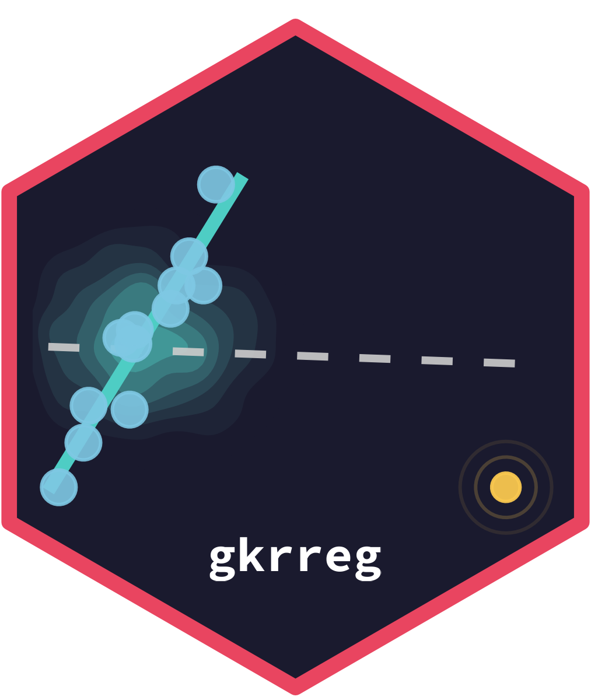

# gkrreg 

<!-- badges: start -->
[](https://CRAN.R-project.org/package=gkrreg)
[](https://github.com/marcelorpf/gkrreg/actions)
[](https://www.gnu.org/licenses/gpl-3.0)
[](https://github.com/marcelorpf/gkrreg/actions/workflows/R-CMD-check.yaml)
<!-- badges: end -->

**Gaussian Kernel Robust Regression** — a convergence-guaranteed robust
regression method that down-weights outliers and leverage points via an
iteratively re-weighted least squares algorithm driven by the Gaussian kernel.

The method was proposed by De Carvalho, Lima Neto & Ferreira (2017,
*Neurocomputing*, 234, 58–74). This package extends the original work with
full statistical inference: an analytic **sandwich variance estimator** (HC0)
and a **pairs bootstrap** with BCa confidence intervals and centred-*t*
p-values.

---

## Installation

```r
# Stable release from CRAN
install.packages("gkrreg")

# Development version from GitHub
# install.packages("remotes")
remotes::install_github("marcelorpf/gkrreg")
```

---

## Quick start

```r
library(gkrreg)

data(belgium_calls)

# Fit with sandwich inference (default)
fit <- gkrr(calls ~ year, data = belgium_calls, sigma_method = "s3")
summary(fit)

# Fit with bootstrap inference (BCa, B = 999)
fit_b <- gkrr(calls ~ year, data = belgium_calls,
              sigma_method = "s3",
              boot      = TRUE,
              boot_args = list(B = 999, type = "bca", seed = 1))
summary(fit_b)

# Diagnostic plots
plot(fit, which = 1:4)
```

---

## Key features

- **Robust fitting** via IRWLS with Gaussian kernel weights — outliers and
  leverage points receive near-zero weight automatically
- **Four estimators for γ²** (the kernel width hyper-parameter):
  - `"s1"` Caputo sub-sample quantiles — clean data
  - `"s2"` Pairwise median — mild contamination
  - `"s3"` Residual variance — heavy contamination / leverage points
  - `"s4"` AICc bandwidth via `sm::h.select()` — large samples (*n* ≥ 200)
  - `"auto"` Data-driven selection among S1–S4 by out-of-bag bootstrap MSE
- **Sandwich inference** (HC0) — analytic, computed at fit time, always
  available via `summary()` and `vcov()`
- **Bootstrap inference** — pairs bootstrap re-estimating γ² on every
  replicate; percentile, normal and BCa intervals; centred-*t* p-values
- **Automatic guidance** — `summary()` warns when sandwich and bootstrap SEs
  diverge by more than 25%, and notes when bootstrap is recommended (*n* < 50
  or heavy contamination detected)
- **Six bundled datasets** covering all outlier scenarios (Y-space, X-space,
  leverage, bad leverage)
- **Six diagnostic panels** — point size inversely proportional to kernel
  weight, with the theoretical kernel curve *G*(*e*) overlaid on panel 3

---

## Inference at a glance

```r
# Sandwich (fast, deterministic — default when boot = FALSE)
fit <- gkrr(y ~ x, sigma_method = "s3")
summary(fit)          # SE, 95% CI, Wald z-test p-values
vcov(fit)             # full sandwich covariance matrix

# Bootstrap (recommended for n < 50 or heavy contamination)
boot <- gkrr_boot(fit, B = 999, type = "bca", seed = 1)
summary(fit, boot = boot)   # BCa CI, centred-t p-values
plot(boot, which = 1)       # histogram + shaded CI per coefficient
plot(boot, which = 2)       # scatter-plot matrix of bootstrap replicates
```

| | Sandwich (HC0) | Bootstrap (BCa) |
|---|---|---|
| Cost | *O*(*np*²) | *O*(*Bnp*²) |
| Accounts for γ̂² variability | No | Yes |
| Reliable for small *n* | Limited | Yes |
| Corrects for skewness | No | Yes |
| Recommended | *n* ≥ 50, mild contamination | *n* < 50 or heavy contamination |

---

## Bundled datasets

| Dataset | *n* | Outlier type | Source |
|---|---|---|---|
| `belgium_calls` | 24 | Y-space | Rousseeuw & Leroy (1987) |
| `cloud_point` | 19 | Leverage | Draper & Smith (1998) |
| `kootenay` | 13 | X-space | Neter et al. (1996) |
| `delivery` | 25 | Bad leverage | Montgomery & Peck (1992) |
| `mammals` | 62 | Leverage (log scale) | Allison & Cicchetti (1976) |
| `stars_cyg` | 47 | Bad leverage | Humphreys (1978) |

---

## Citation

If you use **gkrreg** in your research, please cite both the original method
and the package:

```
De Carvalho, F.A.T., Lima Neto, E.A., Ferreira, M.R.P. (2017).
A robust regression method based on exponential-type kernel functions.
Neurocomputing, 234, 58–74. https://doi.org/10.1016/j.neucom.2016.12.035

Ferreira, M.R.P. and Lima Neto, E.A. (2025).
gkrreg: Gaussian Kernel Robust Regression. R package version 0.4.0.
https://CRAN.R-project.org/package=gkrreg
```

Or in BibTeX:

```bibtex
@Article{DeCarvalho+LimaNeto+Ferreira:2017,
  author  = {{De Carvalho}, Francisco de A.T. and {Lima Neto}, Eufrásio de A.
             and Ferreira, Marcelo R.P.},
  title   = {A Robust Regression Method Based on Exponential-Type Kernel Functions},
  journal = {Neurocomputing},
  year    = {2017},
  volume  = {234},
  pages   = {58--74},
  doi     = {10.1016/j.neucom.2016.12.035},
}

@Manual{gkrreg:2025,
  author = {Ferreira, Marcelo Rodrigo Portela and {Lima Neto}, Eufrásio de Andrade},
  title  = {{gkrreg}: {Gaussian} Kernel Robust Regression},
  year   = {2025},
  note   = {R package version 0.4.0},
  url    = {https://CRAN.R-project.org/package=gkrreg},
}
```

---

## Authors

- **Marcelo Rodrigo Portela Ferreira** — Departamento de Estatística, UFPB
  (<marcelo@de.ufpb.br>)
- **Eufrásio de Andrade Lima Neto** — Departamento de Estatística, UFPB
  (<eufrasio@de.ufpb.br>)

---

## License

GPL-3 © Marcelo Rodrigo Portela Ferreira, Eufrásio de Andrade Lima Neto
